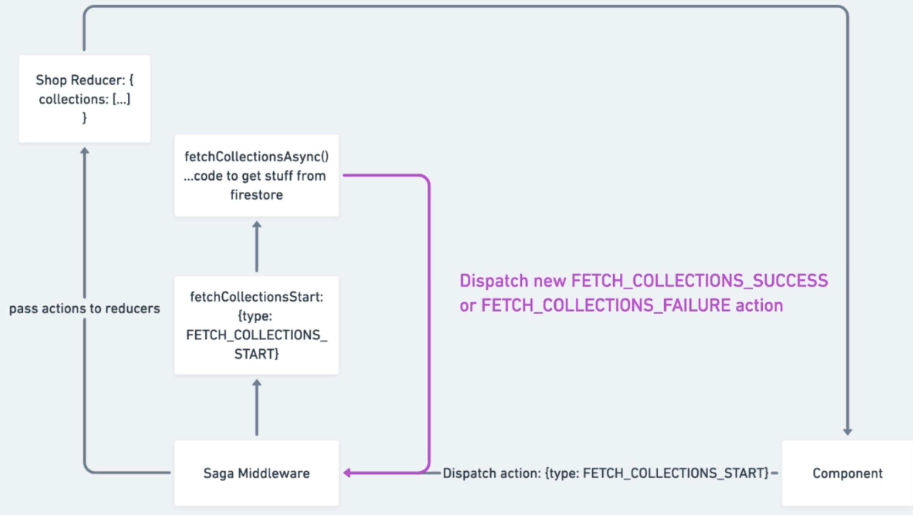
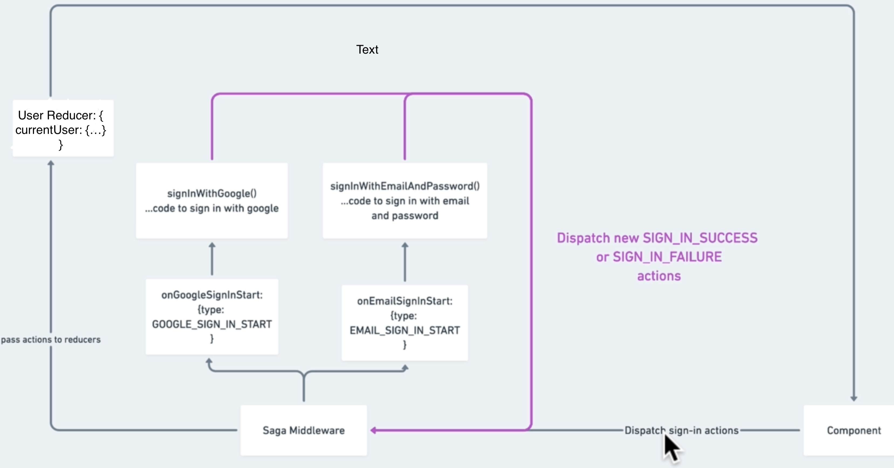
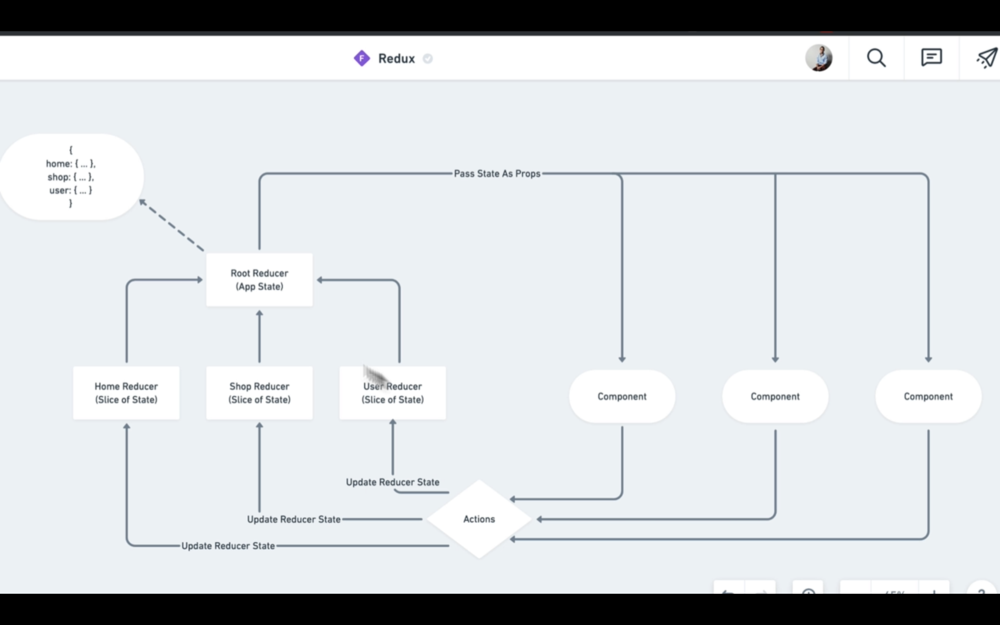
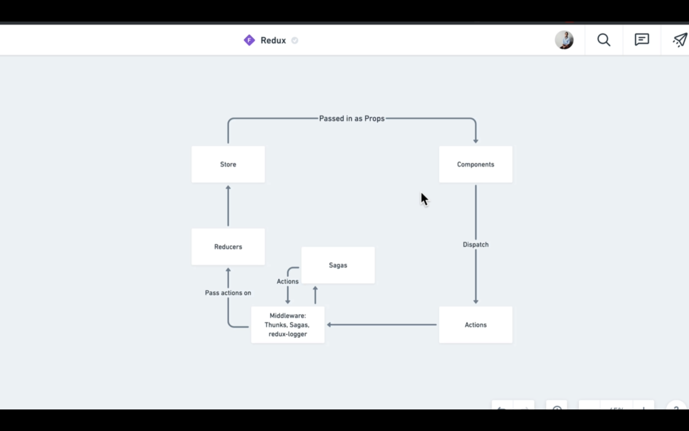

This project was bootstrapped with [Create React App](https://github.com/facebook/create-react-app).
# Current Changes

## ADDED REDUX_SAGAS TO OUR APP
* We just added redux-saga into our application! The first thing we did is to convert our fetchCollectionsStartAsync thunk method into a saga instead to fetch our collections. We added a root-saga which takes all sagas(actions/events) we want our sagas-middleware to listen to. For now we only have the shop
Sagas to get Collections from firestore as soon as it sees that action FETCH_COLLECTIONS_START has been dispatched(which happens as soon as shop-page mounts).

* We also added sign-in/sign-up feature to redux using redux-sagas which listens for start of said action and then fetches required data(which is async);
 

## REDUX

#### REDUX-WORKING

#### REDUX WITH MIDDLEWARES

## Redux-thunk

* ***Thunks** are **actionCreators** that returns a **function** instead of action(i.e normal actionCreators return object)..They also get
**dispatch** as its argument...So whenever an Action-Creator returns a 'function', thunk automatically attaches to it and using dispatch we can dispatch other actions inside this thunk...Thunk is mainly used to perform **asynchronous** actions*

  * In our code, since getting shopData from firestore is asynch and to make it reusable for other pages apart from Shop in future, we made fetching shopData a redux action, dispatching which fetches shopData. Since, it is asynch, we used redux-thunk library to create this action which in turn can fire other actions like fetchSuccess,fetchFailure etc.

## Redux-Saga

**redux-saga** is a library that aims to make application **side effects** (i.e. asynchronous things like data fetching and impure things like accessing the browser cache) easier to manage, more efficient to execute, easy to test, and better at handling failures. It is better than redux-thunk in handling async actions.It uses an ES6 feature called Generators(generator fn) to make those asynchronous flows easy to read, write and test and syntax is similar to async/await.
It can listen to an action being dispatched and also dispatch an action.

*Main **Advantage** over redux-thunk and also of yield over async/await is that with yield an action/fn that has been run can be stopped in-flight i.e from progressing to code after yield as saga-middleware is responsible for calling the generator function's next(), however async fnc and redux-thunk once started can't be aborted.*

To summarize, Redux-saga has listeners for events using take,takeEvery and takeLatest. When an action is dispatch to store that matches Action pattern in listeners, saga-middleware intercepts that action and then does something with it like fetching data from API etc(generally async things) and even dispatch other actions. Once this is done, it then allows redux flow to resume if no other actions being dispatched matches it listeners action-pattern.  

## Previous Changes

*  Moved responsibility of HOC wrapping of Collection and CollectionsOverview Pages from Shop to above Components itself by making new Container files for the 2 components whose job is to render actual Component or Loading Spinner according to condition by wrapping to WithSpinner HOC.
Now Shop's page only role is to route to CollectionPage or CollectionsOverview Page according to route.

   * This was done to ensure seperation of concerns as Job of rendering Loading Spinner or data if available for a component should be its own responsibility.

