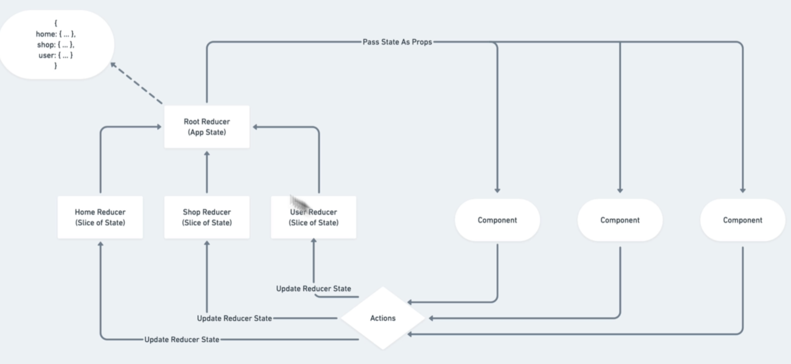
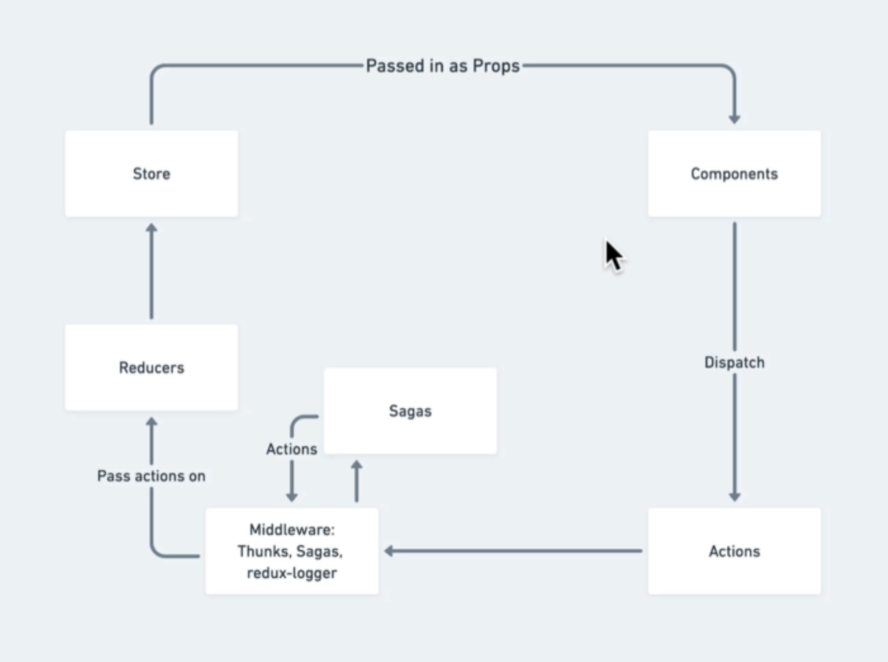
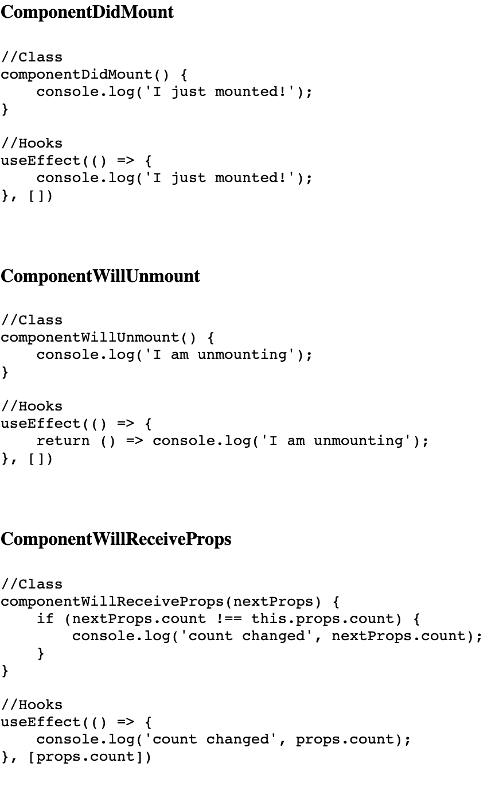
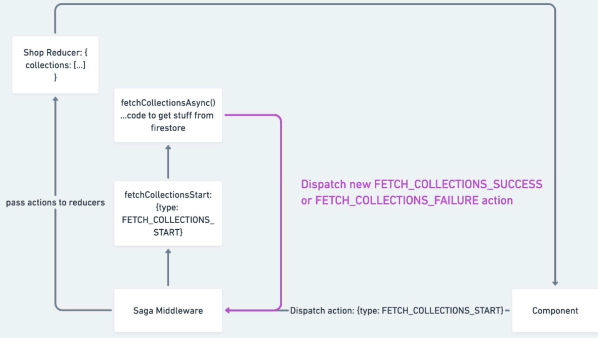
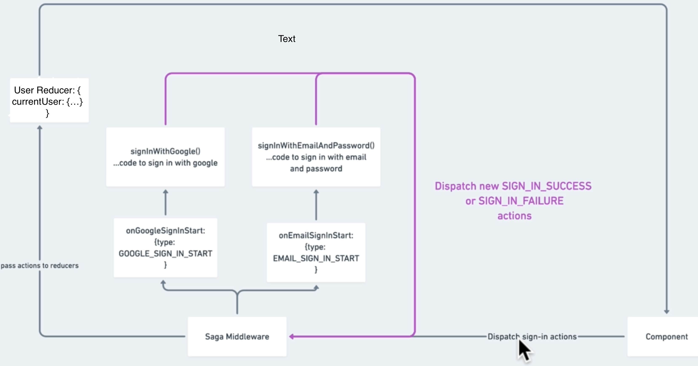

This project was bootstrapped with [Create React App](https://github.com/facebook/create-react-app).
# Current Changes
- Set up a Simple Node server with /payment route that creates charge for stripe payment done in front-end and send this data to stripe for verification and if successful then payment successfully completes. For real payment just activate Stripe Account.
- In heroku no need of 2 deployments for client and server. Just server is deployed and in server.js, we have included how react(front-end) can be included from index.html in build folder.
- React code has been moved to client folder while server code in root in server.js file.
[Stripe-Payment Steps Involved](client/not_project_related/stripe-payment-working.png)
  
## REDUX

#### REDUX-WORKING

#### REDUX WITH MIDDLEWARES

## Redux-thunk

* ***Thunks** are **actionCreators** that returns a **function** instead of action(i.e normal actionCreators return object)..They also get
**dispatch** as its argument...So whenever an Action-Creator returns a 'function', thunk automatically attaches to it and using dispatch we can dispatch other actions inside this thunk...Thunk is mainly used to perform **asynchronous** actions*

  * In our code, since getting shopData from firestore is asynch and to make it reusable for other pages apart from Shop in future, we made fetching shopData a redux action, dispatching which fetches shopData. Since, it is asynch, we used redux-thunk library to create this action which in turn can fire other actions like fetchSuccess,fetchFailure etc.

## Redux-Saga

**redux-saga** is a library that aims to make application **side effects** (i.e. asynchronous things like data fetching and impure things like accessing the browser cache) easier to manage, more efficient to execute, easy to test, and better at handling failures. It is better than redux-thunk in handling async actions.It uses an ES6 feature called Generators(generator fn) to make those asynchronous flows easy to read, write and test and syntax is similar to async/await.
It can listen to an action being dispatched and also dispatch an action.

*Main **Advantage** over redux-thunk and also of yield over async/await is that with yield an action/fn that has been run can be stopped in-flight i.e from progressing to logic after yield command as saga-middleware is responsible for calling the generator function's next(), however async fnc and redux-thunk once started can't be aborted.*

To summarize, Redux-saga has listeners for events using take,takeEvery and takeLatest. When an action is dispatch to store that matches Action pattern in listeners, saga-middleware intercepts that action and then does something with it like fetching data from API etc(generally async things) and even dispatch other actions. Once this is done, it then allows redux flow to resume if no other actions being dispatched matches its listener's action-pattern.  

## REACT_HOOKS
*Hooks are a new addition in React 16.8. They let you use state and other React features without writing a class.*

### Two main type of Hooks:
1. useState()-> mimicks state and setState.. eg: const [ stateName,setStateMethodName ]= useState('Mary') this will make a state with initial value Mary which can be changed as: setStateMethodName('New-Value'). [Example Code](https://github.com/raunak96/React_hooks/blob/8835111260/src/components/use-state-example/use-state-example.component.jsx)
2. useEffect()-> The Effect Hook lets you perform side effects in function components and can be used as componentDidMount, componentDidUpdate, and componentWillUnmount combined. [Example Code](https://github.com/raunak96/React_hooks/blob/8835111260/src/components/use-effect-example/use-effect-example.component.jsx)
 

### Some other Important Hooks
1. useContext()-> Not needed for our App now.
2. useReducer()-> This react native way of local state management whose scope is a Component it is used in. Its syntax is similar to redux but unlike redux it is not a global store and mostly suited for smaller Apps whose state logic is a bit complicated to use useState() hook so useReducer() replaces useState() hook. [Example Code](https://github.com/raunak96/React_hooks/blob/8835111260/src/components/use-reducer-example/use-reducer-example.component.jsx)
3. customHooks()-> Our custom hooks generally written with purpose for reusing it in multiple components and made using above Hooks like useState, useEffect. Naming convention states fn name to start with 'use'. [Example Code](https://github.com/raunak96/React_hooks/blob/8835111260/src/effects/use-fetch.effect.js)
 
## Previous Changes

*  Moved responsibility of HOC wrapping of Collection and CollectionsOverview Pages from Shop to above Components itself by making new Container files for the 2 components whose job is to render actual Component or Loading Spinner according to condition by wrapping to WithSpinner HOC.
Now Shop's page only role is to route to CollectionPage or CollectionsOverview Page according to route.

   * This was done to ensure seperation of concerns as Job of rendering Loading Spinner or data if available for a component should be its own responsibility.
  
* ### ADDED REDUX_SAGAS TO OUR APP

  - We just added redux-saga into our application! The first thing we did is to convert our fetchCollectionsStartAsync thunk method into a saga instead to fetch our collections. We added a root-saga which takes all sagas(actions/events) we want our sagas-middleware to listen to. For now we only have the shop
    Sagas to get Collections from firestore as soon as it sees that action FETCH_COLLECTIONS_START has been dispatched(which happens as soon as shop-page mounts).

  

  - We also added sign-in feature to redux using redux-sagas which listens for start of said action and then fetches required data(which is async).
    

  - Added persistence to sign-in feature.As soon as APP component mounts, an action called CHECK_USER_IN_SESSION is dispatched which is intercepted by redux-saga which then uses firebase utils to check if any user is present in session using auth.onAuthStateChanged and if so currentUser is set by dispatching action SIGN_IN_SUCCESS.

  - We added sign-out feature to redux using sagas similar to above actions i.e clicking SIGN-OUT button dispatches an action '**SIGN_OUT_START**' which is intercepted by user-sagas which then performs the async function to sign out user, which if successful dispatches '**SIGN_OUT_SUCCESS**' and on failure calls '**SIGN_OUT_FAILURE**.If **SIGN_OUT_SUCCESS** was dispatched, currentUser in redux store is set to NULL. Apart from this, cart sagas also listens to this action(sign-out-successful) and then dispatches '**CLEAR_CART**' action to clear the cart if user signed out.

  - We also added the sign-up feature to redux using sagas. Clicking Sign-up button triggers '**SIGN_UP_START**' after which saga signs-up the user which if successful dispatches '**SIGN_UP_SUCCESS**' action which is again intercepted by user-sagas which then dispatches the action '**SIGN_IN_SUCCESS**'.

## ADDED REACT HOOKS TO SOME COMPONENTS of our APP

- Converted the **SIGN-IN** and **SIGN-UP** components to functional component and added and updated state using **useState() Hook**.
- Converted the **APP** and **ShopPage** components to funtional component and added **useEffect() Hook** to mimic componentDidMount used previously.

